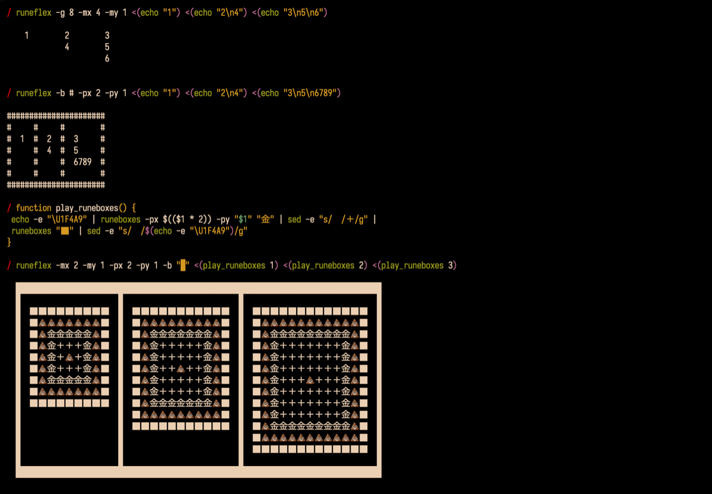

# runeflex

### Image

<!--  -->

### Required

runewidth command is required.  
runewidth "string" is return fixed width of the character "string".

I use [GitHub - mattn/go-runewidth: wcwidth for golang](https://github.com/mattn/go-runewidth) function as command line tool.  
See installation at <https://github.com/kis9a/go-runewidth#fork>

### Installation

```
install_path=/usr/local/bin/runeflex
sudo curl -s https://raw.githubusercontent.com/kis9a/runeflex/main/runeflex > "$install_path"
chmod +x "$install_path"
```

### Usage

```
USAGE:
  runeflex [options] [argument] [file1] [file...]

OPTIONS:
  -h, --help: show help
  -t, --test: test: runeflex_test
  -b, --border: border char of flexbox
  -g, --gap: gap space of flexbox
  -m, --margin: margin size
  -mx, --margin-x: horizontal margin size
  -my, --margin-y: vertical margin size
  -p, --padding: padding size
  -px, --padding-x: horizontal padding size
  -py, --padding-y: vertical padding size

EXAMPLE:
  runeflex -b # -px 2 -py 1 <(echo "a") <(echo "bc\nd") <(echo "efg\nhi\nj")
  runeflex -b # -m 2 -py 0 <(echo "a") <(echo "bc\nd")
  runeflex -b $(echo -e "\U1F4A9") -m 0 -p 0 <(echo "a") <(echo "bc金\nd")
  runeflex -g 4 ./file1 ./file2
```

### Inspired

[GitHub - kis9a/runeboxes: Display the piped string in the character box](https://github.com/kis9a/runeboxes)

### Development

Linter: [GitHub - koalaman/shellcheck: ShellCheck, a static analysis tool for shell scripts](https://github.com/koalaman/shellcheck)  
Formatter: [GitHub - mvdan/sh: A shell parser, formatter, and interpreter with bash support; includes shfmt](https://github.com/mvdan/sh)

### Testing

```bash
git clone https://github.com/kis9a/runeflex
cd runeflex ./runeflex -t
```
